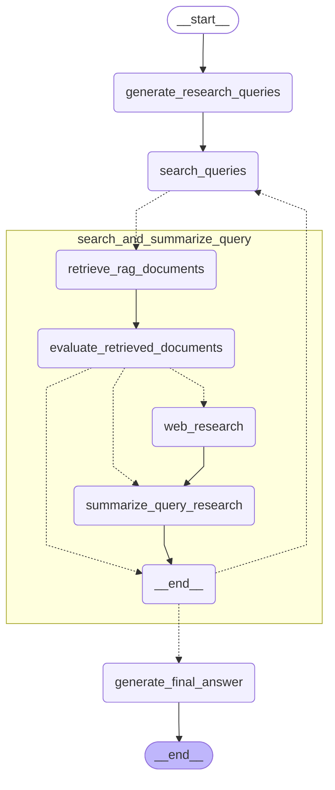

# RAG Researcher — Agent Workflow

```mermaid
---
config:
  flowchart:
    curve: linear
---
graph TD;
	__start__([<p>__start__</p>]):::first
	generate_research_queries(generate_research_queries)
	search_queries(search_queries)
	generate_final_answer(generate_final_answer)
	__end__([<p>__end__</p>]):::last
	__start__ --> generate_research_queries;
	generate_research_queries --> search_queries;
	search_and_summarize_query\3a__end__ -.-> generate_final_answer;
	search_and_summarize_query\3a__end__ -.-> search_queries;
	search_queries -.-> search_and_summarize_query\3aretrieve_rag_documents;
	generate_final_answer --> __end__;
	subgraph search_and_summarize_query
	search_and_summarize_query\3aretrieve_rag_documents(retrieve_rag_documents)
	search_and_summarize_query\3aevaluate_retrieved_documents(evaluate_retrieved_documents)
	search_and_summarize_query\3aweb_research(web_research)
	search_and_summarize_query\3asummarize_query_research(summarize_query_research)
	search_and_summarize_query\3a__end__(<p>__end__</p>)
	search_and_summarize_query\3aevaluate_retrieved_documents -.-> search_and_summarize_query\3a__end__;
	search_and_summarize_query\3aevaluate_retrieved_documents -.-> search_and_summarize_query\3asummarize_query_research;
	search_and_summarize_query\3aevaluate_retrieved_documents -.-> search_and_summarize_query\3aweb_research;
	search_and_summarize_query\3aretrieve_rag_documents --> search_and_summarize_query\3aevaluate_retrieved_documents;
	search_and_summarize_query\3aweb_research --> search_and_summarize_query\3asummarize_query_research;
	search_and_summarize_query\3asummarize_query_research --> search_and_summarize_query\3a__end__;
	end
	classDef default fill:#f2f0ff,line-height:1.2
	classDef first fill-opacity:0
	classDef last fill:#bfb6fc

```
